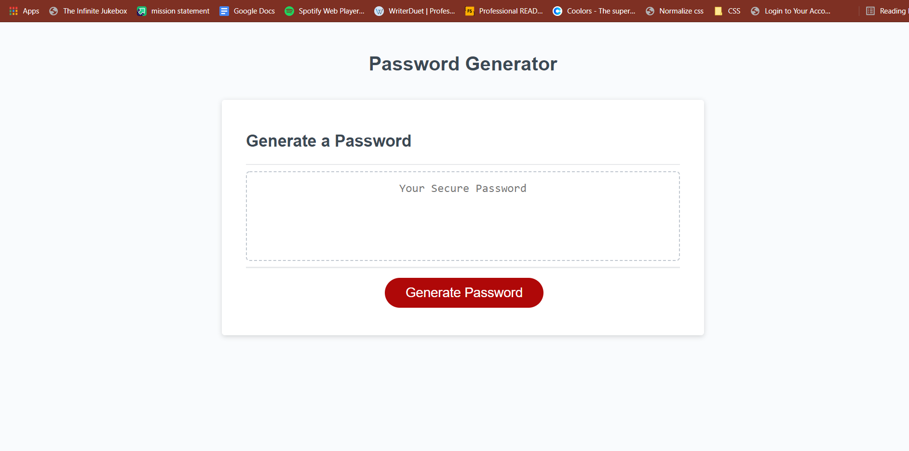
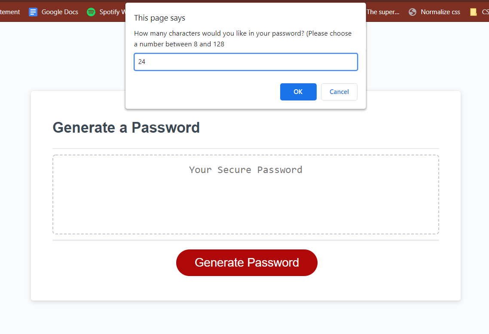
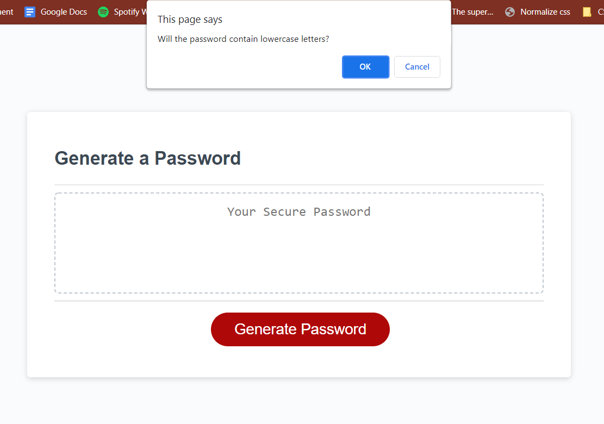
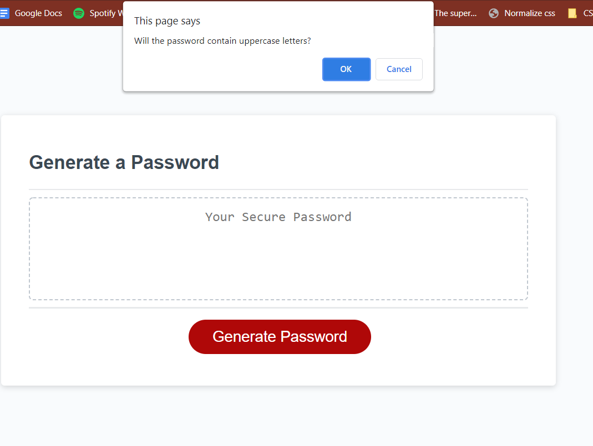
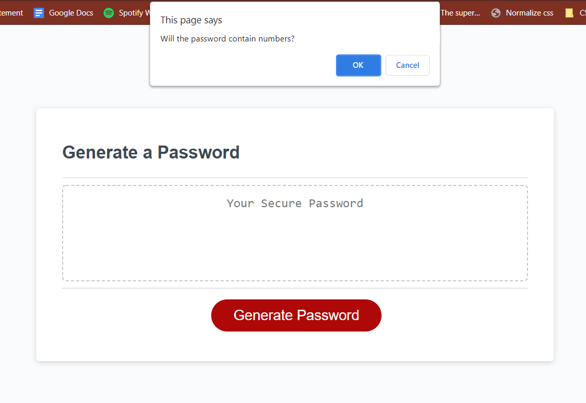
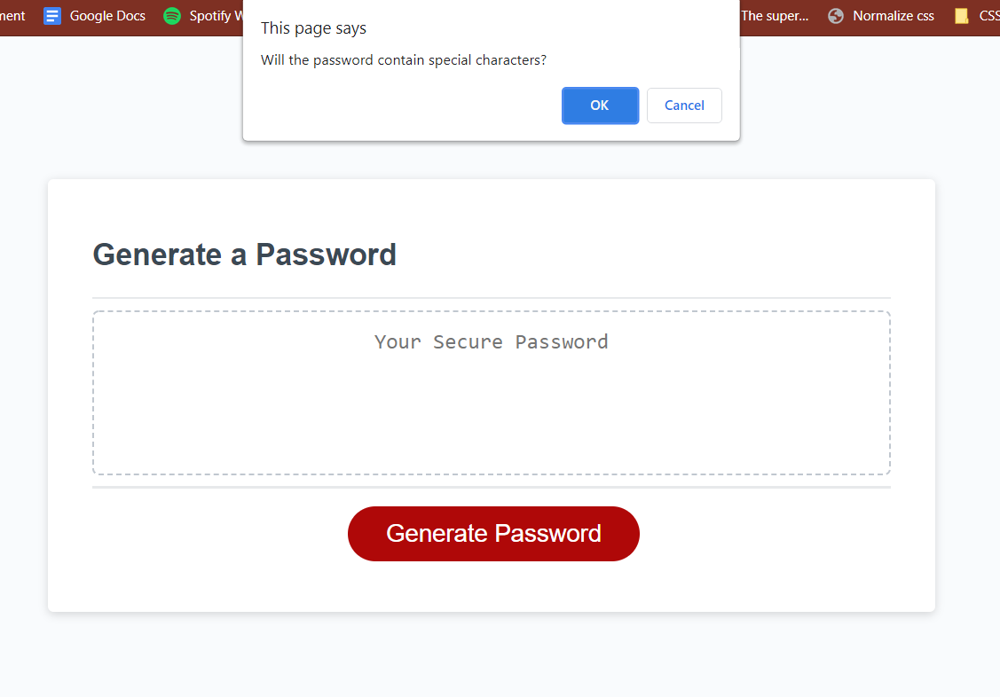
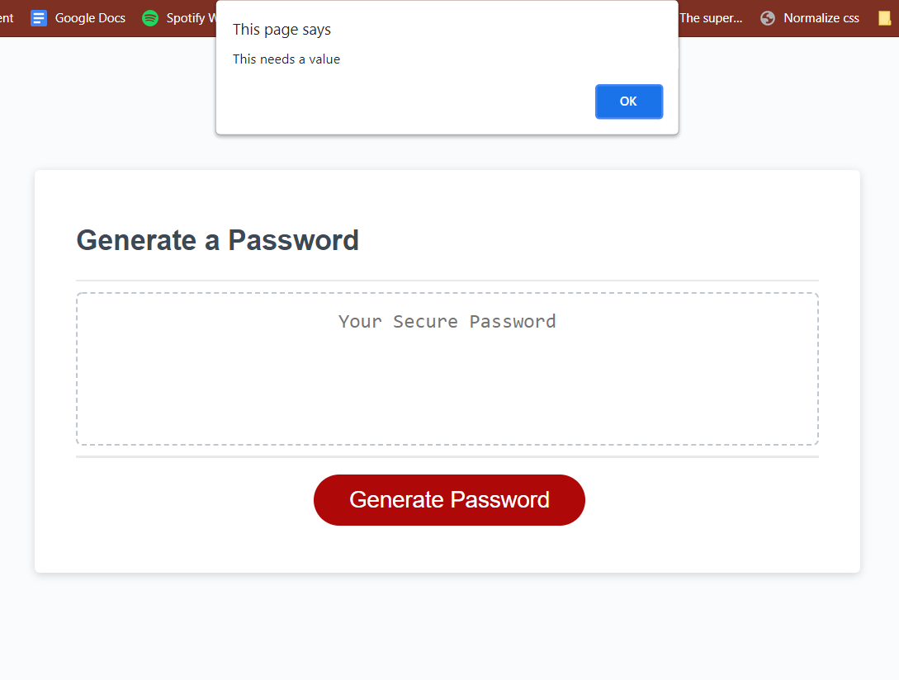
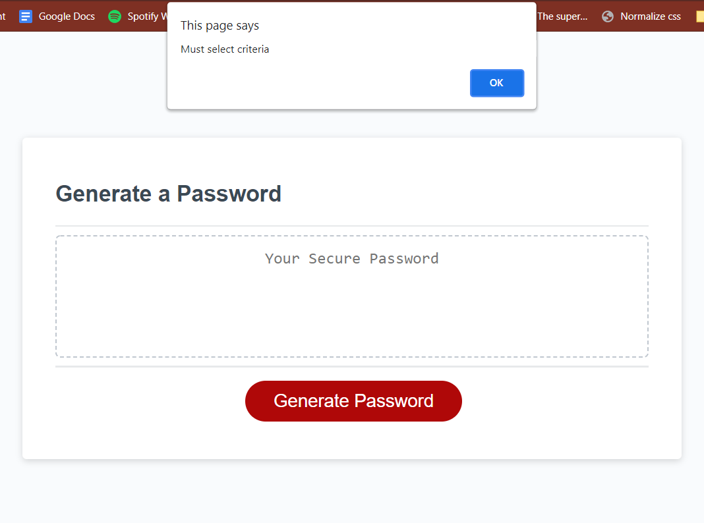

# Password Generator
An application used to generate a secure password using JavaScript

## Description
This project was to create a randomized password generator using JavaScript. First we needed a way to set the amount of characters the user wanted for the password. Then we needed four criteria for the characters of the password, which were lowercase letters, uppercase letters, numbers and special characters. Finally, we created a function in javascript that would select random characters from the acceptable criteria to the amount that was established by the user. There also needed to be messages in case the user submitted value of the characters was not within the guidelines, or if no criteria were selected.

## Installation

The application upon loading

Asking the user for characters

The four criteria

Error messages

Links

-[Portfolio](https://benthackray.github.io/passwordGenerator/)
-[Git repo](https://github.com/benthackray/passwordGenerator)

## Usage
n\a

## Credits
All source code from Trilogy Education Services

## License
Fair Use